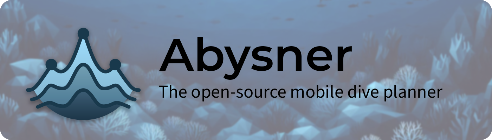
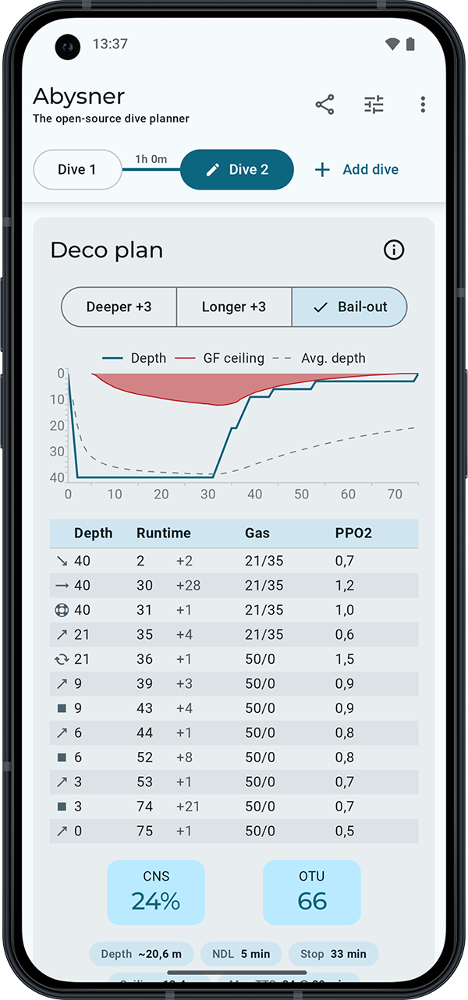

[](https://github.com/NeoTech-Software/abysner/actions/workflows/build.yml)
[)](https://app.codecov.io/gh/NeoTech-Software/abysner/flags)
[)](https://app.codecov.io/gh/NeoTech-Software/abysner/flags)


  
[](https://play.google.com/store/apps/details?id=nl.neotech.app.abysner)
[](https://apps.apple.com/nl/app/abysner/id6636477320)




**The decompression models we use and trust today to plan our dives are the result of decades of
collective research by thousands of people. There is a lot of software available to plan dives,
built on top of this research. However, on Android and iOS the options are limited: either expensive
and proprietary, or lacking a good mobile-friendly interface.**

Abysner /əˈbɪznər/ was built with the goal of giving something back to the diving community. It is
open-source, built with Kotlin Multiplatform and Compose Multiplatform (the best cross-platform
mobile solution to date), available on both Android and iOS, and free to inspect and verify.

> **Disclaimer:** 
> Diving is a potentially dangerous activity. Do not use this application without proper training in
> diving and decompression techniques. This application is in an early development stage, and we
> cannot guarantee that it is free of bugs. Always cross-validate any information presented by the
> application with reliable sources.
>
> No one associated with this project (including authors, contributors, advisors, or any other
> affiliates) can be held responsible for the outcomes of your use of the information provided by
> this application. The use of this application is entirely at your own risk.

Want to build Abysner yourself, contribute, or understand how it works under the hood? Start at
[Building from source](#building-from-source) and the [`docs/`](docs) folder. The
[architecture overview](docs/ARCHITECTURE.md) explains how the code is laid out, and the
[decompression engine deep-dive](docs/DECOMPRESSION.md) documents the deco algorithm in detail.


# Philosophy
Abysner is built with simplicity in mind. Other planners may offer more data or options, but Abysner
is designed to be easy and quick to use, correct enough to trust, on the device you already have in
your pocket.

Prioritizing usability over complexity makes it a practical tool in the field, but as an instructor
myself, also a good fit for the classroom: you can walk students through a real plan on a phone,
no laptop required.


# Features
**Abysner is under active development (imperial units are not available yet), but it already
supports:**

- **Full open-circuit (OC) dive planning**
- **Full closed-circuit rebreather (CCR) dive planning** with configurable setpoints and bailout
- **Buhlmann ZHL-16 A, B and C** with gradient factors
- **Multi-gas:** Air, Nitrox, Oxygen, Trimix, Helitrox, Heliox
- **Intuitive gas selector** showing MOD based on oxygen and gas density
- **User configurable**:
    - SAC rates
    - Environment (salinity, altitude)
    - Descent/ascent rates
    - Gradient factors
    - Deco stop intervals and last deco stop
    - Max PPO2 and gas switch time
    - CCR setpoints (low and high) with automatic switch depth
- **Dive profile graph** with average depth and ceiling
- **Dive plan:** runtime, depth, duration, gas, gas switches, ascents, descents, and more...
- **Oxygen toxicity tracking:** CNS and OTU
- **Contingency plan:** Automatic longer and deeper contingency plan with configurable time and
depth
- **Gas plan:** used and reserve/bailout gas calculation, per-cylinder requirements, warnings,
density and PPO2 information
- **Multi-level** dive planning
- **Multi-dive** planning with surface intervals


# Dive planning
Dives are planned based on bottom sections with automatically calculated ascents and descents.

- To reach the depth of a section the descent or ascent time that is required to reach this depth is
  subtracted from that section's bottom-time.
- The final ascent to the surface is not part of any section and the time it takes is not
  subtracted from anything, instead added to the total dive so far.

**Example (assume no deco):**  
A planned section at 30 meters for 20 minutes at 5 m/min descent/ascent speed will turn into a dive
profile where the first 6 minutes is a descent, then 14 minutes bottom-time, then 6 minutes ascent
time. The total dive time this makes is 26 minutes.


# Gas planning
When the app calculates a dive profile for decompression, it also calculates how much gas is
required for the dive. The gas plan shows two numbers per cylinder: **used gas** and **reserve gas**
for open-circuit dives, or **loop gas** and **bailout gas** for closed-circuit dives.

Both numbers can be based on the contingency (Deeper & Longer) profile if one (or both) of those
options is enabled. This means the contingency settings directly affect gas requirements.

- **Used gas:** How much gas one diver needs to normally complete the profile.

- **Reserve gas:** How much extra gas is required to safely bring up an out-of-air diver from the
worst-possible point during the dive. It is calculated based on the worst TTS in terms of gas usage
(See: [FAQ No. 5](#faq)), however during an out-of-gas scenario your buddy may have a completely
different SAC rate than normal (a panic rate). To account for this, reserve gas is calculated using
the emergency SAC rate, usually at least 2 times higher than your normal SAC rate.

For CCR dives, gas planning works differently. There is no reserve gas for an out-of-air buddy.
Instead, the gas plan shows **loop gas** (diluent and oxygen consumed in the closed-loop) and
**bailout gas**. Bailout tells you how much open-circuit gas you need if the loop fails at the
worst-possible point. It is calculated at the normal SAC rate. CCR divers can adjust their SAC rate
setting to account for the stress of a bailout scenario as they see fit.


# Compared to other planners
Abysner's dive plans are validated against other planners across a range of scenarios: open-circuit,
closed-circuit (CCR) and bailout, multi-level, multi-dive with surface intervals, trimix, and
altitude. The full set of reference plans, with side-by-side comparisons against Subsurface and
DIVESOFT.APP and notes on where and why they differ, lives in
[docs/REFERENCE_PLANS.md](docs/REFERENCE_PLANS.md).

# FAQ

<details>
<summary><strong>1. Does Abysner round to minutes?</strong></summary>

Yes and no, Abysner currently calculates dive plans in whole minutes. The reasoning behind this is
that most of the time we are interested as divers in minutes only, we generate plans to write
down on our wetnotes and for simplicity reasons we do that in minutes.

The above has led me to believe that doing the planning in seconds first, then rounding those to
minutes is kinda pointless and leads to less accurate plans.

> *Example:* if an ascent to a certain level takes 4:20 minutes. This will be rounded to either 4
or 5 minutes but the tissue loading internally was based on those 4 minutes and 20 seconds. So when
following the plan on paper, you either decompress too little during the ascent hitting the ceiling,
or you go a bit slower compared to what was calculated and potentially on-gas certain slower
compartments a bit more.

Instead, Abysner calculates from the very start in whole minutes so that the eventual dive plan does
not need rounding. The downside of this technique is that we have to round some other things, like
ascent and descent speeds. However since the eventual dive plan will be in minutes anyway, this
will be the more realistic case.

*TLDR:* Divers usually require plans in whole minutes, thus calculate in minutes.

Do I consider adding second precision in the future, will it be a setting? Not sure, but the answer
may very well be yes.
</details>

<details>
<summary><strong>2. Why does Abysner give different plans compared to tool X?</strong></summary>

There are countless reasons why this app may give you a different plan, first and foremost: there
is not a single definition of what a dive planner is and how it should work, and this is even
true for the Bühlmann model. There are just many small undefined details that are up to the
implementation to decide.

Robert Helling explains the differences between planners very well in his blog post "Why is Bühlmann
not like Bühlmann":
https://thetheoreticaldiver.org/wordpress/index.php/2017/11/02/why-is-buhlmann-not-like-buhlmann/

If you do feel like something is a bug, feel free to report an issue.
</details>

<details>
<summary><strong>3. Are you qualified to write this software?</strong></summary>

**No.**

I'm a recreational and semi-closed rebreather instructor, technical diver, and consider myself to be
a professional software engineer and awesome programmer. But I'm not a scientist, mathematician,
doctor, or anything like that, so the answer is no.
</details>

<details>
<summary><strong>4. Is Abysner free?</strong></summary>

Abysner is open-source, licensed under AGPLv3. You are free to use, build, modify, and redistribute
it under the terms of that license (that is the "free" part).

The official builds distributed through the Play Store and App Store do carry a small fee. This
covers Apple's yearly developer fee and helps offset other project costs such as a domain name,
development tools, and hardware to test on. If you'd rather not pay, you are welcome to build it
yourself from source or obtain a build from someone else. The license explicitly allows this.
</details>


<details>
<summary><strong>5. How does Abysner determine the worst-case point for reserve gas?</strong></summary>

**TLDR: The TTS that consumes the most gas.**

Most people will tell you this is a point during the deepest part of the dive, or more precisely at
the end of the planned bottom time (just before final ascent). However, with multi-level dive
profiles this can be a slightly more complex story. Because where does the final ascent begin? At
the end of the last bottom section? What if the deeper portion of the dive is at the beginning, and
super short? While a slightly shallower but longer section causes actual decompression time?

>**Example:**
> Assume an ascent/descent rate of 10 meter per minute (40/80 gf). Take a profile where you start
> your dive by descending to 40 meters, then have 1 minute of bottom time after which you ascend to
> 30 meters and stay there for 20 minutes. Then the deepest part of your dive is not the
> worst-possible point to ascend anymore, since your deco obligation at the 40 meters part is still
> essentially non-existent. However, at the end of the 30 meters section you have about 6 minutes of
> deco to complete (with a 50% mix). So those are 6 extra minutes of gas usage, compared to
> ascending from 40 meters, yes the gas usage is shallower, but there is more time to breathe more
> gas as well. So is the deepest section still the worst?

To correctly calculate the worst-possible ascent point during a dive Abysner uses TTS, also known as
time-to-surface. Essentially it calculates how long it would take from any given point during the dive
to ascend safely to the surface (including deco stops if required). The point during the dive where
the TTS is the highest is most likely the worst-possible ascent point. However even this is not the
complete story (see example), in some cases a shallower section at the end of the dive may cause a
longer TTS, and thus potentially more gas usage. So the app calculates ascent gas usage for multiple
TTS points, then takes the maximum numbers for each mix. These maximum numbers are the basis for
calculating the reserve gas requirements.
</details>


# Building from source
Abysner is a [Kotlin Multiplatform](https://kotlinlang.org/docs/multiplatform.html) project that
runs on Android and iOS, with a JVM/desktop target that exists mainly to render Compose previews.
Almost all of the code is shared, so most work happens once and runs everywhere.

**Prerequisites:**

- **JDK 21 or newer** to run Gradle. The Metro dependency-injection plugin requires the build to run
  on Java 21+, so an older JDK fails at configuration. CI uses Temurin (Adoptium) 21.
- The **Android SDK** (compile and target SDK 37, minimum SDK 26) for the Android app. Android
  Studio is the easiest way to get this.
- **Xcode** for the iOS app (macOS only).

You do not need to install Gradle itself, use the included wrapper (`./gradlew`), which pins the
Gradle version for you.

**Quickstart:**

```sh
# Clone
git clone https://github.com/NeoTech-Software/abysner.git
cd abysner

# Run the decompression engine tests
./gradlew :domain:jvmTest

# Run everything CI runs (JVM tests, coverage and screenshot validation)
./gradlew :koverXmlReportDomain :koverXmlReportPresentation
```

**Running the app:**

```sh
# Android: build a debug APK, or install it on a connected device/emulator
./gradlew :androidApp:assembleDebug
./gradlew :androidApp:installDebug

# Desktop (JVM): the fastest way to see the UI without a device or simulator
./gradlew :composeApp:run
```

For iOS, open `iosApp/iosApp.xcodeproj` in Xcode and run it on a simulator or device. Gradle builds
the shared `ComposeApp` framework as part of the Xcode build.

**Common first-run issues:**

- *Build fails with "requires at least JVM runtime version 21", or cannot resolve the Metro plugin*:
  Gradle is running on too old a JDK. Install JDK 21 and make sure Gradle uses it (set `JAVA_HOME` to
  your JDK 21, or select it in your IDE's Gradle settings).
- *Android SDK not found*: open the project once in Android Studio, or create a `local.properties`
  file with `sdk.dir=/path/to/Android/sdk`.

The codebase is split into four Gradle modules (`domain`, `data`, `composeApp`, `androidApp`). See
[Architecture](#architecture) below for what each one does.


# Architecture
Abysner uses a layered architecture split across Gradle modules, with dependencies pointing in one
direction only (`composeApp` -> `data` -> `domain`):

| Module       | What it contains                                                                    |
|--------------|-------------------------------------------------------------------------------------|
| `domain`     | Pure Kotlin business logic: the decompression engine, gas planning, and the models. |
| `data`       | Persistence: repositories, serialization, and platform file access.                 |
| `composeApp` | The shared Compose Multiplatform UI: screens, view models, navigation, theming.     |
| `androidApp` | The Android application wrapper (the iOS wrapper lives in `iosApp`).                 |

The `domain` module has no UI dependencies and is almost entirely shared Kotlin code, so the
decompression math can be read, tested, and verified in isolation.

For a full tour of the codebase (how it is divided, the design patterns used, where to find things,
and how the UI talks to the decompression engine) see [docs/ARCHITECTURE.md](docs/ARCHITECTURE.md).
For an in-depth explanation of the decompression algorithm itself, which is the heart of the app and
the part most worth verifying, see [docs/DECOMPRESSION.md](docs/DECOMPRESSION.md).


# Contributing
If you'd like to contribute, please open an issue or start a discussion before putting significant
effort into a feature or refactor. This project has a specific scope and direction, and not all
pull requests will be accepted. A conversation upfront is the best way to make sure your time is
well spent. See [CONTRIBUTING.md](CONTRIBUTING.md) for the full guidelines, including how to report
bugs, the development workflow, and commit conventions.

All contributors are required to sign a [Contributor License Agreement (CLA)](cla.txt) before
their pull request can be merged. The CLA process is automated via
[CLA Assistant](https://github.com/contributor-assistant/github-action) and will prompt you
automatically when you open a pull request.

> **A personal note on AI:** I use AI assistance where it makes sense, writing boilerplate,
> surfacing bugs, and exploring ideas. But it can't replace correctness and safety, since AI is
> probabilistic, and a safety-relevant application like a dive planner must be deterministic.
> 
> Abysner is not a vibe-coded project. Every architectural decision is made deliberately, every
> algorithm and its results are validated against [known references](#compared-to-other-planners)
> and diving organization standards, peer-reviewed by subject-matter experts including active
> technical diving instructors, and every line of code is reviewed by a person. AI tools are, in my
> opinion, a means to better quality through efficiency, not a substitute for careful and deliberate
> development.

# Credits
This project builds on a lot of prior work: decompression research, open-source planning software,
and the broader diving community. Credit where credit is due.

<details>
<summary>Details</summary>

- [The Theoretical Diver Blog](https://thetheoreticaldiver.org):
    - Particularly helpful for understanding gradient factors, which are not as straightforward to
      implement as the theory makes you believe.
    - Also, a useful reference for the Schreiner equations used in CCR planning.
- Erik C. Baker's publications:
    - Understanding M-Values
    - Clearing Up The Confusion About "Deep Stops"
    - Oxygen Toxicity Calculations
- Open-source software used for validation, comparison, and inspiration (in no particular order):
  [GasPlanner](https://github.com/jirkapok/GasPlanner), [nyxtom/dive](https://github.com/nyxtom/dive), [Subsurface](https://github.com/subsurface/subsurface), [DecoTengu](https://wrobell.dcmod.org/decotengu/index.html)
- [ScubaBoard](https://scubaboard.com): a genuinely valuable source of diving discussions and technical knowledge. For
  example [this thread on the Schreiner equations for CCR](https://scubaboard.com/community/threads/schreiner-equations-for-ccr.554316).

</details>
