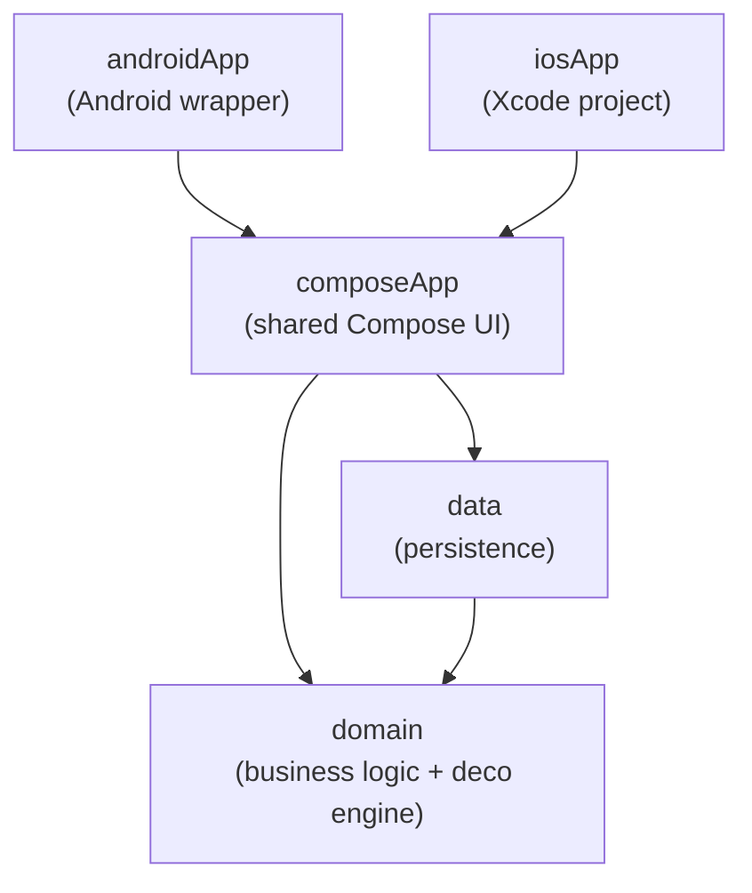
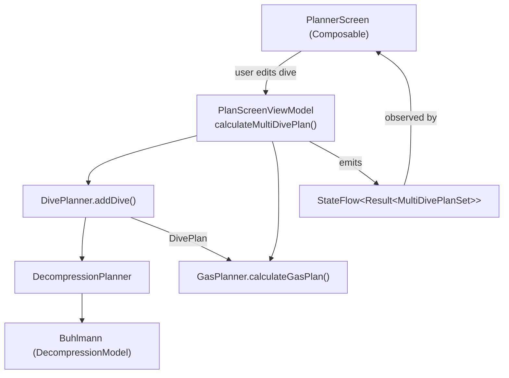

# Architecture

This document explains how the Abysner codebase is laid out, the patterns it uses, and where to
find things. It is aimed at developers who want to contribute, including those who have never worked
on a Kotlin Multiplatform project before. If you are mainly interested in the decompression
algorithm, read this first for the lay of the land, then move on to
[DECOMPRESSION.md](DECOMPRESSION.md).

For build and run instructions see [Building from source](../README.md#building-from-source) in the
main readme.

## A short Kotlin Multiplatform primer

If you already know Kotlin Multiplatform (KMP) you can skip this section.

Abysner is one codebase that compiles to Android, iOS, and a JVM/desktop build. The way KMP makes
that work is through **source sets**. Each module has a `commonMain` source set for code that is
shared across every platform, and optional platform-specific source sets that fill in the gaps:

- `commonMain`: shared code, the large majority of the project. It cannot use Android or iOS APIs
  directly, only Kotlin and multiplatform libraries.
- `androidMain`, `iosMain`, `jvmMain`: platform-specific code for one target.
- `commonTest`: shared tests, which run on the JVM during CI.

When shared code needs something that only a platform can provide (for example, the path to the
app's data folder), KMP uses the `expect`/`actual` mechanism: `commonMain` declares an `expect`
function or class, and each platform source set provides the matching `actual` implementation. You
will see this in the `data` module, where file access differs per platform.

The `domain` module is special: it only has `commonMain` (plus tests) and no platform code at all.
That is deliberate. All the decompression and planning logic is pure Kotlin, so it behaves
identically on every platform and can be tested without any device or simulator.

## Modules

Abysner is split into four Gradle modules (see [`settings.gradle.kts`](../settings.gradle.kts)),
plus the iOS app which is an Xcode project rather than a Gradle module. Dependencies point in one
direction only, so the lower layers never know about the higher ones:

| Module       | Path           | Responsibility                                                          |
|--------------|----------------|------------------------------------------------------------------------|
| `domain`     | [`domain/`](../domain)         | Pure Kotlin: decompression engine, gas planning, physics, models.      |
| `data`       | [`data/`](../data)           | Repositories, serialization (DTOs), DataStore persistence, file access. |
| `composeApp` | [`composeApp/`](../composeApp) | Shared Compose Multiplatform UI: screens, view models, navigation, theme. |
| `androidApp` | [`androidApp/`](../androidApp) | Android `Application` and `Activity` entry points.                       |
| iOS app      | [`iosApp/`](../iosApp)         | SwiftUI wrapper that hosts the shared Compose UI.                        |

All Kotlin code lives under the reverse-domain package `org.neotech.app.abysner` (note: the app's
build identifier is `nl.neotech.app.abysner`, the Kotlin package uses `org`).

### Where do I find...?

| I'm looking for...                     | Look in...                                                        |
|----------------------------------------|------------------------------------------------------------------|
| The decompression algorithm            | `domain/.../decompression/` (start at [DECOMPRESSION.md](DECOMPRESSION.md)) |
| Gas mixes, cylinders, configuration    | `domain/.../core/model/`                                          |
| Physics (pressure, depth, gas laws)    | `domain/.../core/physics/`                                        |
| Gas and oxygen-toxicity planning       | `domain/.../gasplanning/`                                         |
| The public planning entry point        | `domain/.../diveplanning/DivePlanner.kt`                          |
| A screen or UI component               | `composeApp/.../presentation/`                                    |
| A view model                           | `composeApp/.../presentation/screens/`                           |
| How settings and dives are saved       | `data/.../` and `domain/.../persistence/`                        |
| Dependency injection wiring            | `composeApp/.../di/AppComponent.kt`                              |
| Platform entry points                  | `androidApp/`, `composeApp/src/iosMain/`, `composeApp/src/jvmMain/` |

## Design patterns

The project follows a small set of well-known patterns. Each is described below with a real file to
look at.

**Layered (clean) architecture.** Business logic in `domain` knows nothing about persistence or UI.
Persistence in `data` depends on `domain` (it implements interfaces declared there) but not on the
UI. The UI in `composeApp` depends on both. Because the dependency graph is acyclic, you can change
the UI without touching the engine, and verify the engine without building the app.

**Repository pattern.** The `domain` module declares repository interfaces, and `data` provides the
implementations. For example
[`PlanningRepository`](../domain/src/commonMain/kotlin/org/neotech/app/abysner/domain/diveplanning/PlanningRepository.kt)
is the interface, and
[`PlanningRepositoryImpl`](../data/src/commonMain/kotlin/org/neotech/app/abysner/data/diveplanning/PlanningRepositoryImpl.kt)
is the implementation. This keeps storage details out of the domain and UI.

**MVVM with Compose.** Screens are Composables that observe state from a view model. View models
extend the multiplatform `ViewModel` and expose state via `StateFlow`. See
[`PlanScreenViewModel`](../composeApp/src/commonMain/kotlin/org/neotech/app/abysner/presentation/screens/planner/PlanScreenViewModel.kt),
which holds the dive input, runs the planner, and exposes the resulting plan as state. Heavy
calculations run on `Dispatchers.Default` so the UI thread stays responsive.

**Dependency injection.** A single object graph wires the repositories and navigation together (see
the next section).

## Dependency injection (Metro)

Abysner uses [Metro](https://github.com/ZacSweers/metro) for dependency injection. The whole graph
is defined in one place,
[`AppComponent`](../composeApp/src/commonMain/kotlin/org/neotech/app/abysner/di/AppComponent.kt):

- It is annotated `@DependencyGraph` and scoped with `@SingleIn(AppScope::class)`, so the
  repositories are effectively singletons for the app's lifetime.
- `@Provides` functions bind each repository interface to its implementation (for example
  `PlanningRepository` to `PlanningRepositoryImpl`).
- A nested `@DependencyGraph.Factory` accepts the one dependency that has to be built per platform,
  a `PlatformFileDataSource`, and returns the graph.

The factory exists because a Metro graph cannot take constructor parameters, and platform source
sets cannot extend the shared graph. So each platform constructs its own `PlatformFileDataSourceImpl`
and passes it in. The reasoning is documented in a comment in
[`AbysnerApplication`](../androidApp/src/main/kotlin/org/neotech/app/abysner/AbysnerApplication.kt).

Each platform creates the graph at startup and hands it to the shared `App` composable:

| Platform | Entry point                                                                   | Creates the graph in           |
|----------|------------------------------------------------------------------------------|--------------------------------|
| Android  | [`MainActivity`](../androidApp/src/main/kotlin/org/neotech/app/abysner/MainActivity.kt) / [`AbysnerApplication`](../androidApp/src/main/kotlin/org/neotech/app/abysner/AbysnerApplication.kt) | `AbysnerApplication.onCreate()` |
| iOS      | [`MainViewController`](../composeApp/src/iosMain/kotlin/MainViewController.kt) | lazily, in `iosMain`           |
| Desktop  | [`main.kt`](../composeApp/src/jvmMain/kotlin/main.kt)                         | `main()`                       |

## Persistence

Persistence is built on [DataStore](https://developer.android.com/topic/libraries/architecture/datastore)
(the preferences flavor) plus JSON serialization. The single DataStore file holds everything: the
dive configuration, the multi-dive plan input, and the app settings.

The key pattern here is **versioned resource DTOs**. Domain models (like `Configuration`) are not
serialized directly. Instead the `data` module has separate serializable classes such as
[`ConfigurationResourceV1`](../data/src/commonMain/kotlin/org/neotech/app/abysner/data/diveplanning/resources/ConfigurationResourceV1.kt),
[`DivePlanInputResourceV1`](../data/src/commonMain/kotlin/org/neotech/app/abysner/data/diveplanning/resources/DivePlanInputResourceV1.kt),
and
[`SettingsResourceV1`](../data/src/commonMain/kotlin/org/neotech/app/abysner/data/settings/resources/SettingsResourceV1.kt).
Keeping the storage format separate from the domain model means the domain can evolve without
breaking saved data, and the `V1` suffix leaves room to add `V2` with a migration later. The
repository implementations also include migrations from older preference keys so updates do not lose
user data.

File access itself is the one piece that differs per platform, handled through `PlatformFileDataSource`
and its platform implementations in the `data` module.

## Core domain models

These are the data types that flow through the app. They all live under `domain/.../core/model/`
and `domain/.../diveplanning/model/`.

| Model                                                                                                                          | Purpose                                                                  |
|------------------------------------------------------------------------------------------------------------------------------|--------------------------------------------------------------------------|
| [`Gas`](../domain/src/commonMain/kotlin/org/neotech/app/abysner/domain/core/model/Gas.kt)                                     | A breathing gas, defined by its oxygen and helium fractions.             |
| [`Cylinder`](../domain/src/commonMain/kotlin/org/neotech/app/abysner/domain/core/model/Cylinder.kt)                           | A gas plus a tank size and fill pressure.                                |
| [`Configuration`](../domain/src/commonMain/kotlin/org/neotech/app/abysner/domain/core/model/Configuration.kt)                 | All the dive settings: gradient factors, rates, limits, algorithm, etc. |
| [`Environment`](../domain/src/commonMain/kotlin/org/neotech/app/abysner/domain/core/model/Environment.kt)                     | Salinity and atmospheric pressure for the dive.                          |
| [`DiveProfileSection`](../domain/src/commonMain/kotlin/org/neotech/app/abysner/domain/diveplanning/model/DiveProfileSection.kt) | One user-planned bottom section: a depth, a duration, and a cylinder.    |
| [`DivePlanInputModel`](../domain/src/commonMain/kotlin/org/neotech/app/abysner/domain/diveplanning/model/DivePlanInputModel.kt) | The full user input for one dive (sections, cylinders, dive mode).      |
| [`DivePlan`](../domain/src/commonMain/kotlin/org/neotech/app/abysner/domain/diveplanning/model/DivePlan.kt)                   | The calculated result: segments, alternative ascents, CNS/OTU totals.   |
| [`DiveSegment`](../domain/src/commonMain/kotlin/org/neotech/app/abysner/domain/decompression/model/DiveSegment.kt)           | The smallest unit of a plan: a descent, stop, ascent, or gas switch.    |
| [`UnitSystem`](../domain/src/commonMain/kotlin/org/neotech/app/abysner/domain/core/model/UnitSystem.kt)                       | Metric or imperial, with display conversions.                           |

## From the UI to the decompression engine

This is the seam most contributors care about: how a tap in the UI turns into a calculated dive
plan. It all funnels through `PlanScreenViewModel.calculateMultiDivePlan()`, which constructs a
[`DivePlanner`](../domain/src/commonMain/kotlin/org/neotech/app/abysner/domain/diveplanning/DivePlanner.kt)
and a
[`GasPlanner`](../domain/src/commonMain/kotlin/org/neotech/app/abysner/domain/gasplanning/GasPlanner.kt)
and asks them to do the work.

`DivePlanner` turns user sections into pressure changes, hands those to `DecompressionPlanner` for
the stop and gas-switch logic, which in turn drives the `Buhlmann` tissue model. The result, a
`DivePlan`, is then passed to `GasPlanner` for the gas requirements. The view model wraps everything
in a `Result` and emits it as state, so calculation failures (for example, not enough time to
decompress) surface as UI state rather than crashes.

The internals of that chain are the subject of [DECOMPRESSION.md](DECOMPRESSION.md).

## Testing and CI

The decompression engine is covered by a thorough test suite in
[`domain/src/commonTest/`](../domain/src/commonTest). Notable files:

| Test                                   | Covers                                                          |
|----------------------------------------|----------------------------------------------------------------|
| `BuhlmannTest`                         | Tissue model, no-decompression limits, ceilings, snapshots.    |
| `BuhlmannCcrTest`                      | Closed-circuit tissue loading and setpoint handling.           |
| `BuhlmannUtilitiesTest`                | The Schreiner equation, water vapour, CCR inputs.              |
| `DecompressionPlannerTest`             | Stop and ascent logic.                                          |
| `DecoGridTest`                         | Snapping ceilings to deco stops.                               |
| `DivePlannerTest`                      | Full reference plans end to end (matching the readme tables).  |
| `OxygenToxicityCalculatorTest`         | CNS and OTU calculations.                                       |

CI is defined in [`.github/workflows/build.yml`](../.github/workflows/build.yml) and runs three
jobs: JVM tests with coverage and screenshot validation, an Android debug build, and an iOS build.
Coverage is collected with [Kover](https://github.com/Kotlin/kotlinx-kover) and reported separately
for the `domain` (core) and `presentation` (UI) layers. The UI also has screenshot tests, with
reference images stored via Git LFS.

## Map of the decompression engine

The files below make up the decompression engine. Each is explained in detail in
[DECOMPRESSION.md](DECOMPRESSION.md); this table is a quick index.

| File                                                                                                                                          | Role                                                              |
|---------------------------------------------------------------------------------------------------------------------------------------------|------------------------------------------------------------------|
| [`DivePlanner.kt`](../domain/src/commonMain/kotlin/org/neotech/app/abysner/domain/diveplanning/DivePlanner.kt)                               | Public entry point. Turns user sections into a `DivePlan`.       |
| [`DecompressionPlanner.kt`](../domain/src/commonMain/kotlin/org/neotech/app/abysner/domain/decompression/DecompressionPlanner.kt)            | Stop times, ascents, gas switches.                              |
| [`DecoGrid.kt`](../domain/src/commonMain/kotlin/org/neotech/app/abysner/domain/decompression/DecoGrid.kt)                                    | Snapping ceilings to whole deco-stop depths.                    |
| [`DecompressionModel.kt`](../domain/src/commonMain/kotlin/org/neotech/app/abysner/domain/decompression/algorithm/DecompressionModel.kt)      | The interface a decompression model must satisfy.               |
| [`Buhlmann.kt`](../domain/src/commonMain/kotlin/org/neotech/app/abysner/domain/decompression/algorithm/buhlmann/Buhlmann.kt)                 | Bühlmann ZHL-16 tissue model with gradient factors.             |
| [`BuhlmannUtilities.kt`](../domain/src/commonMain/kotlin/org/neotech/app/abysner/domain/decompression/algorithm/buhlmann/BuhlmannUtilities.kt) | Schreiner equation, water vapour, CCR inputs.                  |
| [`DiveSegment.kt`](../domain/src/commonMain/kotlin/org/neotech/app/abysner/domain/decompression/model/DiveSegment.kt)                        | The segment model and segment compaction.                      |
| [`OxygenToxicityCalculator.kt`](../domain/src/commonMain/kotlin/org/neotech/app/abysner/domain/gasplanning/OxygenToxicityCalculator.kt)      | CNS and OTU oxygen toxicity.                                    |
| [`GasPlanner.kt`](../domain/src/commonMain/kotlin/org/neotech/app/abysner/domain/gasplanning/GasPlanner.kt)                                  | Gas requirements (used/reserve, loop/bailout).                 |
