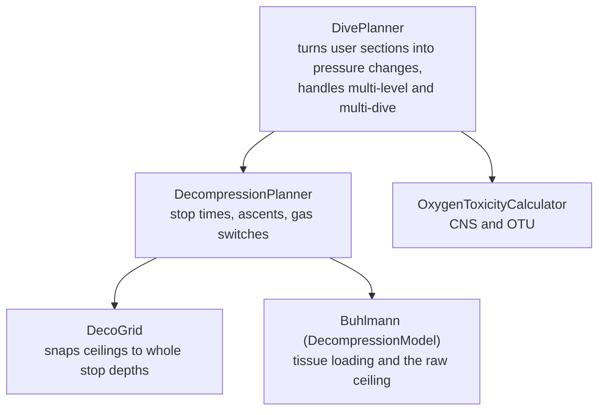

# The decompression engine

This document explains how Abysner plans a dive, in detail. It is the most important document in
this repository, because the decompression engine is the part of the app most worth reading,
checking, and trusting. It is written to be followed by a developer who is comfortable with code but
new to decompression theory, so it starts with a short primer and then works through the actual
implementation, file by file.

Everything here is tied to specific source files. Where a number, formula, or coefficient is quoted,
the source file it comes from is named so you can confirm it yourself.

> **Safety note:** Abysner is a planning aid, not a substitute for training. The explanations below
> describe how the software works, not how to dive. Read the disclaimer in the
> [readme](../README.md) before relying on anything here.


## How to keep this document accurate

This document is maintained by hand, so a few rules keep it from drifting out of sync with the code:

- **One source of truth per fact.** A specific value or table is quoted in one place only, and the
  file it came from is named right next to it. If you change that value in code, update the one spot
  here that quotes it.
- **Formulas and structure are written out in full**, because they rarely change. Long constant
  tables and tunable values are quoted but always point back to their source file as the canonical
  copy. The full 16-row compartment tables, for example, live in `Buhlmann.kt`, not here.
- **Default limits and thresholds** (gradient factors, max ppO2, ascent rates, deco step, and so on)
  all come from
  [`Configuration.kt`](../domain/src/commonMain/kotlin/org/neotech/app/abysner/domain/core/model/Configuration.kt).
  That file is the single source of truth for them.

There is a [maintenance table](#where-to-change-what) at the end mapping each concept to the file
that owns it.


## Decompression in five minutes

When you breathe gas under pressure, the inert part of that gas (nitrogen, and helium if you use it)
dissolves into your body. The deeper you go and the longer you stay, the more dissolves in. This is
called **on-gassing**. When you ascend, the surrounding pressure drops and that dissolved gas comes
back out, which is **off-gassing**.

The danger is ascending too fast. If the pressure drops faster than your body can release the gas,
the dissolved gas can form bubbles, which causes decompression sickness. To avoid that, a dive
planner works out how much inert gas your body has taken on, and how slowly you must ascend
(including pauses, called **decompression stops**) to let it back out safely.

**The Bühlmann ZHL-16 model** is the standard way to estimate this. It models the body as 16
theoretical **tissue compartments**, each on-gassing and off-gassing at a different speed (a
different "half-time"). Fast compartments load and unload quickly (think blood), slow ones take
hours (think bone and fat). At any moment, each compartment has a tolerated ceiling: the shallowest
depth (lowest pressure) it can be exposed to without exceeding its limit. The overall **ceiling** is
the shallowest of all 16. You may not ascend above it.

**Gradient factors** make the model more conservative. The raw Bühlmann limits (the "M-values")
represent the most a compartment can supposedly tolerate. Many divers do not want to ride right up
against that limit, so a gradient factor expresses what fraction of it you allow. Abysner uses two:
`gfLow`, applied at depth (at the deepest stop), and `gfHigh`, applied at the surface, with a linear
interpolation in between. A lower number is more conservative. The defaults are `gfLow = 0.6` and
`gfHigh = 0.7` (from
[`Configuration.kt`](../domain/src/commonMain/kotlin/org/neotech/app/abysner/domain/core/model/Configuration.kt)),
usually written as "60/70".

That is the whole idea: track gas in 16 compartments, compute a ceiling from their tolerances,
apply gradient factors, and ascend no faster than the ceiling allows.


## The big picture

The engine is built in layers. Each layer has one job and hands off to the next.



- [`DivePlanner`](../domain/src/commonMain/kotlin/org/neotech/app/abysner/domain/diveplanning/DivePlanner.kt)
  is the public entry point. You give it a list of bottom sections and cylinders, it gives you back a
  `DivePlan`.
- [`DecompressionPlanner`](../domain/src/commonMain/kotlin/org/neotech/app/abysner/domain/decompression/DecompressionPlanner.kt)
  implements the diving procedures: where to stop, for how long, and when to switch gas. It works
  entirely in absolute pressure (bar).
- [`DecoGrid`](../domain/src/commonMain/kotlin/org/neotech/app/abysner/domain/decompression/DecoGrid.kt)
  knows that divers stop on a grid (every 3 m or 10 ft), and rounds the model's continuous ceiling
  onto that grid.
- [`Buhlmann`](../domain/src/commonMain/kotlin/org/neotech/app/abysner/domain/decompression/algorithm/buhlmann/Buhlmann.kt)
  is the model itself. It only does tissue loading and ceiling calculation, deliberately with no
  planning logic. It implements the
  [`DecompressionModel`](../domain/src/commonMain/kotlin/org/neotech/app/abysner/domain/decompression/algorithm/DecompressionModel.kt)
  interface, so a different model could be dropped in.
- [`OxygenToxicityCalculator`](../domain/src/commonMain/kotlin/org/neotech/app/abysner/domain/gasplanning/OxygenToxicityCalculator.kt)
  computes oxygen exposure (CNS and OTU) after the plan is built.

A note on units that matters throughout: the planner and model work in **absolute ambient pressure
in bar** (depth pressure plus atmospheric pressure). Conversions to and from meters or feet happen
at the edges, via the helpers in
[`Pressure.kt`](../domain/src/commonMain/kotlin/org/neotech/app/abysner/domain/core/physics/Pressure.kt).
Atmospheric pressure at sea level is `1.01325` bar (`ATMOSPHERIC_PRESSURE_AT_SEA_LEVEL` in that
file), adjusted for altitude with the barometric formula.


## Tissue compartments

The model is 16 compartments, defined as `CompartmentParameters` in
[`Buhlmann.kt`](../domain/src/commonMain/kotlin/org/neotech/app/abysner/domain/decompression/algorithm/buhlmann/Buhlmann.kt).
Each compartment carries six numbers: a half-time and two coefficients (`a` and `b`) for nitrogen,
and the same three for helium.

```kotlin
data class CompartmentParameters(
    val n2HalfTime: Double,
    val n2ValueA: Double,
    val n2ValueB: Double,
    val heHalfTime: Double,
    val heValueA: Double,
    val heValueB: Double,
)
```

The nitrogen half-times run from 5 minutes (the fastest compartment) to 635 minutes (the slowest).
There are three versions of the table, `ZH16A`, `ZH16B`, and `ZH16C`, selected by the
`algorithm` setting. As the comment in the source notes, the N2 half-times and the `b` coefficients
are identical across all three versions; **only the nitrogen `a` coefficients differ**. ZHL-16C is
the most conservative of the three and is the default.

The full tables (all 16 rows for each version, with the helium values too) are the canonical copy in
`Buhlmann.kt`, in the `ZH16A_COMPARTMENTS`, `ZH16B_COMPARTMENTS`, and `ZH16C_COMPARTMENTS` lists.
They are not reproduced here to avoid two copies drifting apart. As a representative sample, the
first and last ZHL-16C nitrogen rows are:

| Compartment | N2 half-time (min) | N2 `a` (ZHL-16C) | N2 `b` |
|-------------|--------------------|------------------|--------|
| 1 (fastest) | 5.0                | 1.1696           | 0.5578 |
| 16 (slowest)| 635.0              | 0.2327           | 0.9653 |

The source also documents how these numbers were cross-checked, against Subsurface, DecoTengu, and
dipplanner, with links in the comment above the tables.

At runtime each compartment is a `TissueCompartment` that tracks its current nitrogen and helium
partial pressures (`pNitrogen`, `pHelium`) and their sum (`pTotal`). A fresh compartment starts
fully saturated with nitrogen at the surface:

```kotlin
private var pNitrogen: Double = partialPressure(environment.atmosphericPressure - waterVapourPressure, 0.79),
private var pHelium: Double = 0.0,
```

That is, it assumes you have been breathing air (79% nitrogen) at the surface long enough to be in
equilibrium, with the alveolar water vapour already subtracted (see the next sections).


## The Schreiner equation

When the diver spends time at a depth, or changes depth, each compartment's gas pressure has to be
updated. Abysner uses the **Schreiner equation** for this, implemented in
[`BuhlmannUtilities.kt`](../domain/src/commonMain/kotlin/org/neotech/app/abysner/domain/decompression/algorithm/buhlmann/BuhlmannUtilities.kt):

```kotlin
fun schreinerEquation(initialTissuePressure: Double, inspiredGasPressure: Double, time: Double, halfTime: Double, inspiredGasRate: Double): Double {
    val timeConstant = ln(2.0) / halfTime
    return (inspiredGasPressure + (inspiredGasRate * (time - (1.0 / timeConstant))) - ((inspiredGasPressure - initialTissuePressure - (inspiredGasRate / timeConstant)) * exp(-timeConstant * time)))
}
```

In words, this is the standard Schreiner form:

```
P(t) = Pio + R * (t - 1/k) - (Pio - Po - R/k) * e^(-k*t)
```

where:

- `Po` is the compartment's current inert gas pressure (`initialTissuePressure`).
- `Pio` is the inspired inert gas pressure at the start of the segment (`inspiredGasPressure`).
- `R` is the rate at which the inspired inert gas pressure changes per minute, which is non-zero
  during a depth change (`inspiredGasRate`).
- `k` is the compartment's time constant, `ln(2) / halfTime`.
- `t` is the time in minutes.

The reason for Schreiner rather than the simpler Haldane equation is the `R` term. Haldane assumes a
constant inspired pressure, which is fine for a flat segment but wrong during a descent or ascent,
where the inspired pressure changes the whole time. Schreiner handles the changing-depth case
directly, so the same function works for flat, descending, and ascending segments. Note the function
itself knows nothing about water vapour; the caller is responsible for subtracting it before
computing `Pio` and `R`.


## Water vapour and inspired pressure

The gas in your lungs is not the same pressure as the gas in your tank. Your alveoli are saturated
with water vapour at body temperature, and that vapour takes up part of the pressure, leaving less
for the gas you actually breathe. So before applying gas fractions, the model subtracts the alveolar
water vapour pressure from the ambient pressure.

The water vapour pressure is computed with the
[Antoine equation](https://en.wikipedia.org/wiki/Antoine_equation) in `BuhlmannUtilities.kt`
(`waterVapourPressure` / `waterVapourPressureInBars`), assuming a body temperature of 37 degrees
Celsius. That works out to roughly 0.063 bar. The single source of truth for the temperature is the
`waterVapourPressure` constant in `Buhlmann.kt`:

```kotlin
private val waterVapourPressure: Double = waterVapourPressureInBars(37.0)
```

So the inspired inert gas pressure on open circuit is `(ambient - waterVapour) * inertFraction`,
using the `partialPressure` helper from
[`Pressure.kt`](../domain/src/commonMain/kotlin/org/neotech/app/abysner/domain/core/physics/Pressure.kt)
(which is just Dalton's law: `totalPressure * fraction`).


## Loading the tissues

Tissue loading happens in `TissueCompartment.addPressureChange()` in `Buhlmann.kt`. It calculates
the rate of pressure change per minute, then branches on whether this is an open-circuit or
closed-circuit segment. Nitrogen and helium are always tracked independently, each with its own
half-time and its own Schreiner call.

A guard rejects zero or negative durations, both because they make no physical sense and because
they would divide by zero when computing the rate.

### Open circuit

On open circuit the breathing gas has fixed fractions, so loading is direct. From
`addPressureChangeOc`:

```kotlin
val inspiredPressure = startPressure - waterVapourPressure

this.pNitrogen = schreinerEquation(
    initialTissuePressure = pNitrogen,
    inspiredGasPressure = partialPressure(inspiredPressure, fN2),
    time = timeInMinutes,
    halfTime = parameters.n2HalfTime,
    inspiredGasRate = partialPressure(depthChangeInBarsPerMinute, fN2),
)
```

The same is done for helium with the helium fraction and helium half-time. The oxygen fraction does
not appear, because oxygen is metabolized and is not an inert gas to track for decompression.

### Closed circuit

On a closed-circuit rebreather (CCR), the loop holds the oxygen partial pressure at a constant
**setpoint**, so the inert gas pressure does not follow ambient pressure in the simple open-circuit
way. The trick Abysner uses is `ccrSchreinerInputs` (in `BuhlmannUtilities.kt`), which computes an
effective inspired pressure and rate so that the *same* Schreiner equation still applies. The inert
gas partial pressure on CCR works out to:

```
(ambient - setpoint) * inertFraction / (1 - oxygenFractionDiluent)
```

`(ambient - setpoint)` is the pressure left over once the oxygen setpoint is accounted for, and
dividing by `(1 - oxygenFractionDiluent)` rescales the diluent's inert fraction to exclude the
diluent oxygen the setpoint already covers. This stays linear in ambient pressure, which is exactly
what Schreiner needs.

One complication is handled explicitly in `addPressureChangeCcr`: the setpoint cannot be held once
ambient pressure drops below it (the loop maxes out on pure oxygen). So when a segment crosses the
setpoint pressure during an ascent or descent, the segment is split at the exact crossing point. On
the deep side normal CCR loading applies; on the shallow side there is no inert gas being inspired at
all (inspired pressure and rate are both zero). The setpoint passed in is first corrected for water
vapour (`ccrSetpoint + waterVapourPressure`).

The CCR inputs are verified in `BuhlmannUtilitiesTest` against both the Helling CCR Schreiner
formulation and a brute-force Haldane simulation.


## M-values, ceilings, and gradient factors

The ceiling is where decompression theory becomes a number. There are two related calculations in
`Buhlmann.kt`.

### The raw per-compartment ceiling

`TissueCompartment.calculateCeiling(gf)` returns the shallowest pressure a single compartment
tolerates, for a given gradient factor. Because both nitrogen and helium are present, their `a` and
`b` coefficients are first combined, weighted by their partial pressures:

```kotlin
val a = ((parameters.n2ValueA * this.pNitrogen) + (parameters.heValueA * this.pHelium)) / (this.pTotal)
val b = ((parameters.n2ValueB * this.pNitrogen) + (parameters.heValueB * this.pHelium)) / (this.pTotal)

val ceiling = (this.pTotal - (a * gf)) / ((gf / b) + 1.0 - gf)
```

With `gf = 1.0` this is the raw Bühlmann M-value limit. A smaller `gf` pulls the tolerated pressure
deeper (more conservative). The result is clamped so it never goes above the surface pressure.

### Applying gradient factors across the dive

A single `gf` is not the whole story, because Abysner interpolates between `gfLow` at the deepest
ceiling and `gfHigh` at the surface. This is `toleratedInertGasPressure()`, the most involved piece
of math in the engine. It:

1. Computes the tolerated inert gas pressure at the surface using `gfHigh`.
2. Computes the tolerated inert gas pressure at the lowest ceiling reached so far using `gfLow`.
3. Treats those as two points on a line, solves for that line's slope and intercept, and inverts it
   to get the tolerated ambient pressure for the compartment's current loading.

The "lowest ceiling reached so far" is tracked across the whole dive in the `Buhlmann.lowestCeiling`
field, and updated in `getMinimumToleratedAmbientPressure()`. That history matters: the gradient
factor line is anchored to the deepest stop the diver actually needed, not just the current depth.
The source has an extended comment deriving the slope and intercept, along with the references it was
built from (Subsurface, the OSTC gradient factor document, dive-tech's M-values paper, and
DecoTengu).

The overall ceiling for the whole model is then the deepest (highest pressure) ceiling across all 16
compartments, exposed via `Buhlmann.getCeiling()`.


## The deco-stop grid

The model produces a continuous ceiling in bar, but divers stop at whole depths on a fixed grid
(every 3 m, or 10 ft in imperial), and there is a configured last stop depth (3 m by default). That
grid logic is isolated in
[`DecoGrid`](../domain/src/commonMain/kotlin/org/neotech/app/abysner/domain/decompression/DecoGrid.kt),
which keeps it out of both the model and the planner.

It has three jobs:

- `snapCeilingToDecoGrid(rawCeiling)` rounds a raw ceiling **up** (deeper) to the next grid stop. If
  the result would land between the surface and the configured last stop, it clamps to the last stop.
- `findNextDecoStopPressure(from)` returns the next shallower stop. If already exactly on a grid
  point, it goes one step shallower.
- `isAtDecoStop(pressure)` reports whether a pressure sits on a grid point, which is used to align
  gas switches to stops.

The grid is configured in pressure, not depth, but it is built so stops always land on whole display
units. `DivePlanner.createDecompressionPlanner()` constructs it from the configured `decoStepSize`,
`lastDecoStopDepth`, and the display unit (meter or foot), converting each to a pressure delta. A
constructor check enforces that the deco step is an exact multiple of the display unit, so you never
get a stop at, say, 2.9 m.


## The planner loop

[`DecompressionPlanner`](../domain/src/commonMain/kotlin/org/neotech/app/abysner/domain/decompression/DecompressionPlanner.kt)
ties the model and the grid together into an actual ascent. The two building blocks are `addFlat()`
and `addDepthChange()`, which apply a segment to the model and record a `DiveSegment`. Both run the
model minute by minute (except in lookahead mode, see below), so tissue loading is always evaluated
in whole-minute steps. A central detail: **the whole engine plans in whole minutes**, which is a
deliberate design choice explained in [Design decisions](#design-decisions-and-known-divergences).

The heart of it is `calculateDecompression(toAmbientPressure, breathingMode)`. Roughly, it does
this:

1. Find the first deco ceiling from the current depth, via `findFirstDecoCeiling()`.
2. On open circuit, check whether a better deco gas is available right now and switch if so.
3. Ascend to that first ceiling (the gas-switch-aware ascent is `addDecoDepthChange()`).
4. Loop while the ceiling is still below the surface:
   - work out the next shallower stop,
   - add one-minute stops at the current depth until the ceiling clears enough to move up,
   - ascend to the next ceiling.
5. Stop once the ceiling reaches the surface (or the requested target pressure).

There is a safety valve inside the stop loop: if a compartment cannot off-gas enough to ever reach
the next stop (for example, a last stop set too shallow with extremely conservative gradient
factors), the loop gives up after 1000 minutes and throws a `PlanningException` with an explanation,
rather than spinning forever.

### Lookahead and the ceiling-skip optimization

Because the engine plans in whole minutes, a ceiling that is only a hair deeper than a stop would
otherwise cost a full extra minute at the deeper stop, even if a few seconds of off-gassing during
the ascent would clear it. To avoid that penalty, the planner simulates the ascent before committing
to it. `isCeilingClearedDuringAscent()` runs the ascent, checks whether the ceiling cleared, and
then rolls the model back.

That rollback is the `lookahead {}` helper. It snapshots the planner state and the model, runs the
block, and restores everything afterward, so these "what if" calculations never affect the real
plan. The same mechanism powers time-to-surface (TTS) calculations, see below. The model side of the
rollback is `DecompressionModel.resetAfter {}`, which snapshots and restores the tissue state.

### Gas switching

On open circuit, the planner picks the best available gas at each stop. `addDecoDepthChange()` walks
up from the current pressure, and at each grid stop asks `decoGases.findBetterGasOrFallback(...)`
whether a better gas (higher oxygen, within the ppO2 and END limits) is now breathable. If so it
emits a `GAS_SWITCH` segment and continues on the new gas. The gas-switch time (1 minute by default)
is spent on the *old* gas, modeling the diver still breathing the previous gas while preparing to
switch. Gas switching is skipped entirely on CCR, since the diver stays on the loop. A CCR-to-OC
bailout is handled as a special case at the top of `calculateDecompression()`.

The limits used here come from the configuration: `maxPPO2Deco` (1.6 bar by default) for the deco
ppO2 ceiling, and `maxEND` (30 m) for the equivalent narcotic depth. END is computed in
[`Gas.kt`](../domain/src/commonMain/kotlin/org/neotech/app/abysner/domain/core/model/Gas.kt),
treating both oxygen and nitrogen as narcotic.


## Oxygen toxicity (CNS and OTU)

Breathing oxygen at raised partial pressure is itself a hazard, tracked two ways in
[`OxygenToxicityCalculator.kt`](../domain/src/commonMain/kotlin/org/neotech/app/abysner/domain/gasplanning/OxygenToxicityCalculator.kt).
Both are computed from the finished segment list, after the plan is built (in `DivePlanner.addDive`).
The work is based on Erik Baker's papers and Robert Helling's write-ups, with the references listed
in the file header.

The shared input is the effective oxygen partial pressure, `effectivePartialOxygenPressure()`. On
open circuit it is simply `oxygenFraction * ambientPressure`. On CCR it is
`min(max(setpoint, diluentPpO2), ambient)`, so the ppO2 follows the setpoint but can never exceed
ambient pressure at shallow depths.

### CNS

CNS (central nervous system) toxicity is accumulated per segment, using the average pressure of the
segment. Below a ppO2 of 0.5 bar it contributes nothing. Above that, the per-minute rate is an
exponential fit to the NOAA exposure table, with two line segments (one up to ppO2 1.5, one above):

```kotlin
private fun getCnsPpo2Slope(ppO2: Double): Double {
    if(ppO2 <= 1.5) {
        return -11.7853 + (1.93873 * ppO2)
    }
    return -23.6349 + (9.80829 * ppO2)
}
```

and the contribution of a segment is `(duration * 60) * exp(slope) * 100`, giving a percentage. The
source notes a 2025 proposal to relax the 1.3 bar limit, with a pointer to re-fit the curve if the
NOAA table is updated, a good example of a value to keep an eye on.

### OTU

OTU (oxygen toxicity units, the "whole body" measure) uses the improved Baker/Helling formula that
works for flat, ascending, and descending segments without dividing by zero. With `Pm` defined as
`(ppO2Start + ppO2End) - 1.0`:

```kotlin
val pm = (ppo2Start + ppo2End) - 1.0
val rate = pm.pow(5.0 / 6.0) * (1.0 - 5.0 * (ppo2End - ppo2Start).pow(2) / 216 / (pm * pm))
return rate * durationInMinutes
```

As with CNS, exposure below 0.5 bar is ignored, and when only part of a segment is above 0.5 bar the
duration is scaled to just that part.


## Gas planning

Once the dive profile exists, [`GasPlanner`](../domain/src/commonMain/kotlin/org/neotech/app/abysner/domain/gasplanning/GasPlanner.kt)
works out how much gas it needs. This is separate from decompression but uses the same segments.

For **open circuit** it reports two numbers per cylinder:

- *Used gas*: the gas to complete the planned profile, at the normal SAC rate. Per segment this is
  `duration * sacRate * averagePressure`, summed per cylinder.
- *Reserve gas*: enough to bring an out-of-air diver up from the worst point of the dive, at the
  emergency SAC rate (`sacRateOutOfAir`, double the normal rate by default).

The "worst point" is not simply the deepest point. Abysner uses time-to-surface (TTS) to find it.
During planning, the `DecompressionPlanner` records an alternative ascent (and its TTS) at the end of
each section, using the `lookahead` mechanism. `findWorstCaseAscentCandidates()` then narrows these
down to the segments that could plausibly demand the most gas, and the actual gas usage is computed
for each candidate, taking the maximum per mix. The reasoning, including why a shallower section can
be worse than a deeper one, is explained in FAQ 5 of the [readme](../README.md#faq).

For **closed circuit** the numbers are different. There is no buddy reserve; instead the plan reports
loop gas (oxygen consumed metabolically at `ccrMetabolicO2LitersPerMinute`, plus diluent added to
the loop on descent based on `ccrLoopVolumeLiters`) and bailout gas (the worst-case open-circuit
ascent at the normal SAC rate).

Cylinder capacity itself is not a simple pressure-times-volume product. It uses a real-gas model
([`GasEquationOfStateModel`](../domain/src/commonMain/kotlin/org/neotech/app/abysner/domain/core/physics/GasEquationOfStateModel.kt),
defaulting to `PolynomialRealGasModel`), because real gases deviate from the ideal gas law at the
high pressures used in scuba cylinders.


## A worked example, end to end

Here is the simplest reference plan from `DivePlannerTest`, walked through the engine. The exact
expected output is asserted by `referencePlan1_producesExpectedSegments()`.

Input:

- One section: 20 meters for 20 minutes, on air (21/0), in a 12 L steel cylinder.
- Configuration: ascent and descent rate 5 m/min, gradient factors 30/70, fresh water, sea level,
  ZHL-16C, deco step 3 m, last stop 3 m. (Note this example uses 30/70 to match the readme reference
  table; the app default is 60/70.)

What happens:

1. `DivePlanner.addDive()` creates a `Buhlmann` model (ZHL-16C, GF 30/70) and a
   `DecompressionPlanner` with a 3 m grid.
2. The single section needs a descent first. At 5 m/min, reaching 20 m takes 4 minutes, so
   `addDepthChange` loads the tissues over a 4-minute descent from the surface to 20 m.
3. The remaining bottom time is `20 - 4 = 16` minutes, applied with `addFlat` at 20 m.
4. The final ascent calls `calculateDecompression(toAmbientPressure = surface)`. At 20 m for this
   short a time the ceiling never drops below the surface, so no stops are required. The ascent from
   20 m to the surface at 5 m/min takes 4 minutes.
5. `OxygenToxicityCalculator` runs over the finished segments.

The result is three segments, matching the test and the readme's reference plan 1:

| Type    | Depth        | Duration | Runtime |
|---------|--------------|----------|---------|
| Descent | 0 -> 20 m    | 4 min    | 4 min   |
| Flat    | 20 m         | 16 min   | 20 min  |
| Ascent  | 20 -> 0 m    | 4 min    | 24 min  |

with `totalCns = 2.731` and `totalOtu = 5.443` (both asserted to three decimals in the test). For a
plan that does involve stops and gas switches, see reference plans 2 and onward in the
[readme](../README.md#compared-to-other-planners), all of which are also covered by `DivePlannerTest`.


## Design decisions and known divergences

A few choices are worth calling out, because they explain why Abysner's plans can differ from other
tools.

- **Whole-minute planning.** Abysner calculates the whole dive in whole minutes from the start,
  rather than computing in seconds and rounding at the end. Divers write plans in minutes, and
  planning in minutes from the start means the plan needs no rounding that would otherwise leave you
  slightly under- or over-decompressed. The trade-off is that ascent and descent speeds are rounded
  instead. This is discussed in FAQ 1 of the [readme](../README.md#faq).
- **Why plans differ from other planners.** Even within "Bühlmann with gradient factors" there are
  many small implementation details that are simply undefined, so two correct planners can produce
  different stops. Robert Helling's article
  ["Why is Bühlmann not like Bühlmann"](https://thetheoreticaldiver.org/wordpress/index.php/2017/11/02/why-is-buhlmann-not-like-buhlmann/)
  is the best explanation. The readme's "Compared to other planners" section documents specific
  differences against Subsurface and DIVESOFT.APP.
- **Determinism.** A dive planner must be deterministic and reproducible. The engine is pure Kotlin
  with no randomness and no platform dependencies, which is also what makes it straightforward to
  cover with the reference-plan tests.


## Where to change what

This table maps each concept to the file that owns it, so a change in the code maps to one place to
update here.

| Concept                                        | Source of truth                                                                 |
|------------------------------------------------|---------------------------------------------------------------------------------|
| Default GF, ppO2, rates, deco step, SAC, CCR setpoints | [`Configuration.kt`](../domain/src/commonMain/kotlin/org/neotech/app/abysner/domain/core/model/Configuration.kt) |
| Compartment tables (half-times, a/b)           | [`Buhlmann.kt`](../domain/src/commonMain/kotlin/org/neotech/app/abysner/domain/decompression/algorithm/buhlmann/Buhlmann.kt) (`ZH16*_COMPARTMENTS`) |
| Ceiling and gradient-factor math               | [`Buhlmann.kt`](../domain/src/commonMain/kotlin/org/neotech/app/abysner/domain/decompression/algorithm/buhlmann/Buhlmann.kt) (`calculateCeiling`, `toleratedInertGasPressure`) |
| Schreiner equation, water vapour, CCR inputs   | [`BuhlmannUtilities.kt`](../domain/src/commonMain/kotlin/org/neotech/app/abysner/domain/decompression/algorithm/buhlmann/BuhlmannUtilities.kt) |
| Body temperature for water vapour              | [`Buhlmann.kt`](../domain/src/commonMain/kotlin/org/neotech/app/abysner/domain/decompression/algorithm/buhlmann/Buhlmann.kt) (`waterVapourPressure`) |
| Stop grid and last-stop logic                  | [`DecoGrid.kt`](../domain/src/commonMain/kotlin/org/neotech/app/abysner/domain/decompression/DecoGrid.kt) |
| Stop times, ascents, gas switching, TTS        | [`DecompressionPlanner.kt`](../domain/src/commonMain/kotlin/org/neotech/app/abysner/domain/decompression/DecompressionPlanner.kt) |
| Multi-level and multi-dive orchestration       | [`DivePlanner.kt`](../domain/src/commonMain/kotlin/org/neotech/app/abysner/domain/diveplanning/DivePlanner.kt) |
| CNS and OTU formulas                            | [`OxygenToxicityCalculator.kt`](../domain/src/commonMain/kotlin/org/neotech/app/abysner/domain/gasplanning/OxygenToxicityCalculator.kt) |
| Gas requirements (used/reserve, loop/bailout)  | [`GasPlanner.kt`](../domain/src/commonMain/kotlin/org/neotech/app/abysner/domain/gasplanning/GasPlanner.kt) |
| Gas mixes, MOD, END, density                    | [`Gas.kt`](../domain/src/commonMain/kotlin/org/neotech/app/abysner/domain/core/model/Gas.kt) |
| Pressure, depth, altitude conversions          | [`Pressure.kt`](../domain/src/commonMain/kotlin/org/neotech/app/abysner/domain/core/physics/Pressure.kt) |


## References

These are the main sources the engine is built on. They are also credited in the
[readme](../README.md#credits).

- [The Theoretical Diver](https://thetheoreticaldiver.org) (Robert Helling), especially the articles
  on gradient factors, oxygen toxicity, and the Schreiner equations for CCR.
- Erik C. Baker: "Understanding M-Values", "Clearing Up The Confusion About Deep Stops", and
  "Oxygen Toxicity Calculations".
- Open-source planners used for cross-checking the compartment data and behavior:
  [Subsurface](https://github.com/subsurface/subsurface),
  [DecoTengu](https://wrobell.dcmod.org/decotengu/index.html),
  [GasPlanner](https://github.com/jirkapok/GasPlanner), and
  [nyxtom/dive](https://github.com/nyxtom/dive).
