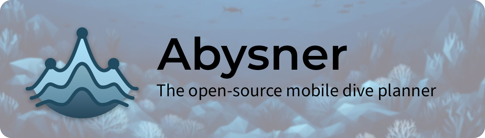

> **Note:** Abysner is currently not yet available on the App Store & Play Store, only as a private beta. Please be patient, coming soon!


**The decompression models we use and trust today to plan our dives are the result of literally centuries worth of collective research by thousands of people. There is a lot of software available to the public to plan dives, built on top of this collective research. However on Android and iOS the options are pretty limited, either behind a paywall, closed-source or lack a good mobile friendly interface.**

Abysner was built with the goal of giving something back to the diving community. Abysner is open-source, free¹, and available on both Android and iOS. It was built using the best available cross-platform solution to date: Kotlin Multi-platform and Compose. The main goal of the app is not to be the most feature rich, instead it aims to be user friendly and simple.

_¹See: [FAQ No. 4](#faq)_

> **Disclaimer:** 
> Diving is a potentially dangerous activity. Do not use this application without proper training in diving and decompression techniques. This application is in an early development stage, and we cannot guarantee that it is free of bugs. Always cross-validate any information presented by the application with reliable sources.
>
> No one associated with this project (including authors, contributors, advisors, or any other affiliates) can be held responsible for the outcomes of your use of the information provided by this application. The use of this application is entirely at your own risk.

# Features

**Abysner is still in early stages of development, right now it supports the following features:**

- Buhlmann ZHL-16 A, B and C decompression models with gradient factors
- Metric only*
- Multi-gas ready (unlimited): 
    - Air
    - Nitrox 
    - Oxygen
    - Trimix
    - Helitrox
    - Heliox
- Open-circuit diving only*
- Configurable:
    - SAC rates
    - Environment (salinity, altitude etc.)
    - Descend and ascend rates
    - Gradient factors
    - Decompression stop intervals
    - Last deco stop
    - MAX PPO2 during deco and normal diving
- Modern gas mixer for choosing gas mixes
    - MOD (oxygen and density based) are shown
- Graph showing dive profile, average depth and ceiling information
- Dive plan:
    - In basic or advanced mode
    - Runtime, depth, duration, gasses, gas (switches), ascends, descends are all shown
    - Time to deco (NDL limit)
- Automatic contingency plan (longer & deeper)
    - configurable extra time and depth
- Gas plan:
    - Chart showing how many gas is required per mix
    - Density and PPO2 information at maximum depth for each mix
- Multi-level dive planning

The development plan for this application is to first see how the reception will be, then stabilize the current basic feature set, before adding new features.

# Dive planning
Dives are planned based on bottom sections with automatically calculated ascents and descents.

- To reach the depth of a section the descent or ascent time that is required to reach this depth is
  subtracted from that sections bottom-time.
- The final ascent to the surface is not part of any section and the time it takes is not
  subtracted from anything, instead added to the total dive so far.

**Example (assume no deco):**  
A planned section at 30 meters for 20 minutes at 5 m/min descent/ascent speed wil turn into a dive
profile where the first 6 minutes is a descent, then 14 minutes bottom-time, then 6 minutes ascent time.
The total dive time this makes is 26 minutes.

# Gas planning
When the app calculates a dive profile for decompression, it also calculate how much gas is required
for the dive. This gas calculation is always based on the contingency plan (Deeper & Longer) plan,
and contains 2 things:

- How much gas one diver needs to normally complete the contingency profile
- How much extra gas is required to safely bring up an out-of-air diver from the wost-possible point during the dive.

The extra gas is calculated based on the worst TTS in terms of gas usage (See: [FAQ No. 5](#faq)),
however during a out-of-gas scenario your buddy may have a completely different SAC rate then normal
(a panic rate). To account for this reserve gas is calculated not using the normal SAC rate but
using the emergency SAC rate, usually this is at least 2 times higher then your normal SAC rate.

# Planned features
_This list is by no means complete, prioritised or a commitment._

- **Warnings:**
  - Isobaric counterdiffusion warnings
  - Overview of all dive warnings
- **Localization:**
  - Different languages
  - Imperial (instead of only metric)
- **UX:**
  - Clickable graphs with more details
  - Option to choose theme (dark/light/auto)
- **Planning:**
  - Share created dive plans (by other means then screenshotting them)
  - Configurable SAC rate during deco
  - Support for CCR and SCR (constant PPO2) diving
  - Multi-dive planning and surface intervals
  - VPM-B support
  - Auto-time mode (time is automatically calculated for a section based on ascent/descent speed)
- **Gas planning:**
   - Gas plans with tank selection
   - Automatic gas selection for sections
- **Other:**
   - NDL tables
   - Gas blending calculator

# Compared to other planners
How do Abysner dive plans compare to dive plan created by other dive planners? Below are some
reference plans. If you want to recreate a reference plan, these are the settings used by all of
them, some settings (Gradient factors, Salinity, Altitude and Last-deco stop) are specific for each
plan, see the plan specific tables for those.


| **Setting**        | **Value**        |
|--------------------|------------------|
| Ascent             | 5 m/min          |
| Descent            | 5 m/min          |
| Algorithm          | Bühlmann ZHL-16C |
| Deco PPO2          | 1.6              |
| Bottom/travel PPO2 | 1.4              |
| END                | 30 meter         |
| O2 Narcotic        | true             |

## Reference plan 1
**20 meter, 20 minutes\*, single-gas (21/0)**

| GF    | Salinity | Altitude | Last-deco stop |
|-------|----------|----------|----------------|
| 30/70 | Fresh    | 0 meters | 3 meter        |

<details>
<summary>Abysner</summary>

| Depth | Duration | Runtime | Gas  |
|-------|----------|---------|------|
| 20m   | 4min     | 4min    | 21/0 |
| 20m   | 16min    | 20min   | 21/0 |
| 0m    | 4min     | 24min   | 21/0 |
**CNS**: 3%  
**OTU**: 6
</details>

<details>
<summary>Subsurface</summary>

| Depth | Duration | Runtime | Gas  |
|-------|----------|---------|------|
| 20m   | 4min     | 4min    | 21/0 |
| 20m   | 16min    | 20min   | 21/0 |
| 0m    | 4min     | 24min   | 21/0 |
**CNS**: 3%  
**OTU**: 6  
*Subsurface (6.0.5214-CICD-release)*
</details>

<details>
<summary>DIVESOFT.APP</summary>

| Depth | Duration | Runtime | Gas  |
|-------|----------|---------|------|
| 20m   | 4min     | 4min    | 21/0 |
| 20m   | 16min    | 20min   | 21/0 |
| 0m    | 4min     | 24min   | 21/0 |
**CNS**: 2%  
**OTU**: 5  
*DIVESOFT.APP (Android 1.8.4)*
</details>

## Reference plan 2
**30 meter, 30 minutes\*, multi-gas**

| GF    | Salinity | Altitude | Last-deco stop |
|-------|----------|----------|----------------|
| 30/70 | Salt     | 0 meters | 6 meter        |

<details>
<summary>Abysner</summary>

|   | Depth | Duration | Runtime | Gas  |
|---|-------|----------|---------|------|
| ➘ | 30m   | 6min     | 6min    | 21/0 |
| ➙ | 30m   | 24min    | 30min   | 21/0 |
| ➚ | 21m   | 2min     | 32min   | 21/0 |
| ➚ | 9m    | 3min     | 35min   | 50/0 |
| ⏹ | 9m    | 2min     | 37min   | 50/0 |
| ⏹ | 6m    | 11min    | 48min   | 50/0 |
| ➚ | 0m    | 2min     | 50min   | 50/0 |
**CNS**: 12%  
**OTU**: 35
</details>

<details>
<summary>Subsurface</summary>

> **Observations:**  
> - Subsurface adds 1 minute of gas switching time, which abysner does currently not. 
> - Subsurface does not show descent to first stop, instead the descent duration is added to the decompression time.

|   | Depth | Duration | Runtime | Gas  |
|---|-------|----------|---------|------|
| ➘ | 30m   | 6min     | 6min    | 21/0 |
| ➙ | 30m   | 24min    | 30min   | 21/0 |
| ➚ | 21m   | 2min     | 32min   | 21/0 |
| - | 21m   | 1min     | 33min   | 50/0 |
| ⏹ | 9m    | 3min     | 36min   | 50/0 |
| ⏹ | 6m    | 11min    | 47min   | 50/0 |
| ➚ | 0m    | 1min     | 48min   | 50/0 |
**CNS**: 13%  
**OTU**: 34  
*Subsurface (6.0.5214-CICD-release)*
</details>

<details>
<summary>DIVESOFT.APP</summary>

> **Observations:**
> DIVESOFT.APP table is kinda confusing:
> 'Stop time' not 'duration' is not shown ('stop time' does not include ascent time). Since the
> table below shows duration, the duration for the DIVESOFT.APP table has been calculated by
> subtracting the runtime in the previous row from the current row. (to make the table read similar
> to Subsurface and Abysner)

|   | Depth | Duration | Runtime | Gas  |
|---|-------|----------|---------|------|
| ➘ | 30m   | 6min     | 6min    | 21/0 |
| ➙ | 30m   | 24min    | 30min   | 21/0 |
| ➚ | 21m   | 2min     | 32min   | 21/0 |
| ➚ | 9m    | 2min     | 34min   | 50/0 |
| ⏹ | 9m    | 1min     | 35min   | 50/0 |
| ⏹ | 6m    | 13min    | 48min   | 50/0 |
| ➚ | 0m    | 2min     | 50min   | 50/0 |
**CNS**: 11%  
**OTU**: 32  
*DIVESOFT.APP (Android 1.8.4)*
</details>


## Reference plan 3
**45 meter, 15 minutes\*, multi-gas, trimix**

| GF    | Salinity | Altitude | Last-deco stop |
|-------|----------|----------|----------------|
| 30/70 | Salt     | 0 meters | 3 meter        |

<details>
<summary>Abysner</summary>

|   | Depth | Duration | Runtime | Gas   |
|---|-------|----------|---------|-------|
| ➘ | 45m   | 9min     | 9min    | 21/35 |
| ➙ | 45m   | 6min     | 15min   | 21/35 |
| ➚ | 21m   | 5min     | 20min   | 21/35 |
| ➚ | 6m    | 3min     | 23min   | 50/0  |
| ⏹ | 6m    | 3min     | 26min   | 50/0  |
| ⏹ | 3m    | 5min     | 31min   | 50/0  |
| ➚ | 3m    | 1min     | 32min   | 50/0  |
**CNS**: 9%  
**OTU**: 25
</details>

<details>
<summary>Subsurface</summary>

> **Observations:**  
> - Subsurface adds 1 minute of gas switching time, which abysner does currently not.
> - Subsurface does not show descent to first stop, instead the descent duration is added to the decompression time.

|   | Depth | Duration | Runtime | Gas   |
|---|-------|----------|---------|-------|
| ➘ | 45m   | 9min     | 9min    | 21/35 |
| ➙ | 45m   | 6min     | 15min   | 21/35 |
| ➚ | 21m   | 5min     | 20min   | 21/35 |
| - | 21m   | 1min     | 21min   | 50/0  |
| ⏹ | 6m    | 5min     | 26min   | 50/0  |
| ⏹ | 3m    | 5min     | 31min   | 50/0  |
| ➚ | 0m    | 1min     | 32min   | 50/0  |
**CNS**: 10%  
**OTU**: 26  
*Subsurface (6.0.5214-CICD-release)*
</details>

<details>
<summary>DIVESOFT.APP</summary>

> **Observations:**
> DIVESOFT.APP table is kinda confusing:
> 'Stop time' not 'duration' is not shown ('stop time' does not include ascent time). Since the
> table below shows duration, the duration for the DIVESOFT.APP table has been calculated by
> subtracting the runtime in the previous row from the current row. (to make the table read similar
> to Subsurface and Abysner)

|   | Depth | Duration | Runtime | Gas   |
|---|-------|----------|---------|-------|
| ➘ | 45m   | 9min     | 9min    | 21/35 |
| ➙ | 45m   | 6min     | 15min   | 21/35 |
| ➚ | 21m   | 5min     | 20min   | 21/35 |
| ➚ | 9m    | 2min     | 22min   | 50/0  |
| ⏹ | 9m    | 1min     | 23min   | 50/0  |
| ⏹ | 6m    | 2min     | 25min   | 50/0  |
| ⏹ | 3m    | 7min     | 32min   | 50/0  |
| ➚ | 0m    | 1min     | 33min   | 50/0  |
**CNS**: 9%  
**OTU**: 23  
*DIVESOFT.APP (Android 1.8.4)*
</details>


## Reference plan 4
**60 meter, 20 minutes\*, multi-gas, trimix, altitude**

| GF    | Salinity | Altitude    | Last-deco stop |
|-------|----------|-------------|----------------|
| 40/85 | Fresh    | 1000 meters | 3 meter        |

<details>
<summary>Abysner</summary>

|   | Depth | Duration | Runtime | Gas   |
|---|-------|----------|---------|-------|
| ➘ | 60m   | 12min    | 12min   | 18/45 |
| ➙ | 60m   | 8min     | 20min   | 18/45 |
| ➚ | 21m   | 8min     | 28min   | 18/45 |
| ⏹ | 21m   | 1min     | 29min   | 50/0  |
| ⏹ | 18m   | 2min     | 31min   | 50/0  |
| ⏹ | 15m   | 2min     | 33min   | 50/0  |
| ⏹ | 12m   | 2min     | 35min   | 50/0  |
| ⏹ | 9m    | 3min     | 38min   | 50/0  |
| ⏹ | 6m    | 6min     | 44min   | 50/0  |
| ⏹ | 3m    | 12min    | 56min   | 50/0  |
| ➚ | 0m    | 1min     | 57min   | 50/0  |
**CNS**: 16%  
**OTU**: 43
</details>

<details>
<summary>Subsurface</summary>

> **Observations:**  
> - Subsurface adds 1 minute of gas switching time, which abysner does currently not.
> - Subsurface does not show descent to first stop, instead the descent duration is added to the decompression time.
> - Subsurface seems to calculate altitude pressure differently, Abysner uses 1013 hPa at sea level and calculates the pressure at altitude assuming constant temperature of 15 degrees celsius, this is slightly different compared to Subsurface, however the difference is small and should not impact the plan much.

|   | Depth | Duration | Runtime | Gas   |
|---|-------|----------|---------|-------|
| ➘ | 60m   | 12min    | 12min   | 18/45 |
| ➙ | 60m   | 8min     | 20min   | 18/45 |
| ➚ | 21m   | 8min     | 28min   | 18/45 |
| - | 21m   | 1min     | 29min   | 50/0  |
| ⏹ | 15m   | 3min     | 32min   | 50/0  |
| ⏹ | 12m   | 2min     | 34min   | 50/0  |
| ⏹ | 9m    | 5min     | 39min   | 50/0  |
| ⏹ | 6m    | 8min     | 47min   | 50/0  |
| ⏹ | 3m    | 14min    | 61min   | 50/0  |
| ➚ | 0m    | 1min     | 62min   | 50/0  |
**CNS**: 16%  
**OTU**: 43  
*Subsurface (6.0.5214-CICD-release)*
</details>

<details>
<summary>DIVESOFT.APP</summary>

> **Observations:**
> DIVESOFT.APP does not support setting an altitude! This plan has been based on 0 meters instead of
> 1000 meters used in the other planners.
> 
> 
> DIVESOFT.APP table is kinda confusing:
> 'Stop time' not 'duration' is not shown ('stop time' does not include ascent time). Since the
> table below shows duration, the duration for the DIVESOFT.APP table has been calculated by
> subtracting the runtime in the previous row from the current row. (to make the table read similar
> to Subsurface and Abysner)

|   | Depth | Duration | Runtime | Gas   |
|---|-------|----------|---------|-------|
| ➘ | 60m   | 12min    | 12min   | 18/45 |
| ➙ | 60m   | 8min     | 20min   | 18/45 |
| ➚ | 21m   | 8min     | 28min   | 18/45 |
| ➚ | 18m   | 0min     | 28min   | 18/45 |
| ⏹ | 18m   | 1min     | 29min   | 50/0  |
| ⏹ | 15m   | 3min     | 32min   | 50/0  |
| ⏹ | 12m   | 2min     | 34min   | 50/0  |
| ⏹ | 9m    | 5min     | 39min   | 50/0  |
| ⏹ | 6m    | 8min     | 47min   | 50/0  |
| ⏹ | 3m    | 17min    | 64min   | 50/0  |
| ➚ | 0m    | 1min     | 65min   | 50/0  |
**CNS**: 17%  
**OTU**: 47  
*DIVESOFT.APP (Android 1.8.4)*
</details>


## Reference plan 5
**40 meter max, multi-level (cave-profile) dive, single-gas trimix**

*Note: this is not meant to be a realistic scenario.*

<details>
<summary>Plan details</summary>

```
In:
- Descent: 40 meter, 8 minutes
- Flat:    40 meter, 2 minutes
- Ascent:  30 meter, 2 minutes
- Flat:    30 meter, 8 minutes
Out:
- Flat: 30 meter, 8 minutes
- Descent: 40 meter, 2 minutes
- Flat: 40 meter, 2 minutes
- Ascent: at 5 m/min max (as planned by planner)
```
</details>

| GF    | Salinity | Altitude | Last-deco stop |
|-------|----------|----------|----------------|
| 50/80 | Fresh    | 0 meters | 3 meter        |

<details>
<summary>Abysner</summary>

|   | Depth | Duration | Runtime | Gas   |
|---|-------|----------|---------|-------|
| ➘ | 40m   | 8min     | 8min    | 21/20 |
| ➙ | 40m   | 2min     | 10min   | 21/20 |
| ➚ | 30m   | 2min     | 12min   | 21/20 |
| ➙ | 30m   | 16min    | 28min   | 21/20 |
| ➘ | 40m   | 2min     | 30min   | 21/20 |
| ➙ | 40m   | 2min     | 32min   | 21/20 |
| ➚ | 9m    | 7min     | 39min   | 21/20 |
| ⏹ | 9m    | 3min     | 42min   | 21/20 |
| ⏹ | 6m    | 7min     | 49min   | 21/20 |
| ⏹ | 3m    | 16min    | 65min   | 21/20 |
| ➚ | 0m    | 1min     | 66min   | 21/20 |
**CNS**: 9%  
**OTU**: 26
</details>

<details>
<summary>Subsurface</summary>

|   | Depth | Duration | Runtime | Gas   |
|---|-------|----------|---------|-------|
| ➘ | 40m   | 8min     | 8min    | 21/20 |
| ➙ | 40m   | 2min     | 10min   | 21/20 |
| ➚ | 30m   | 2min     | 12min   | 21/20 |
| ➙ | 30m   | 16min    | 28min   | 21/20 |
| ➘ | 40m   | 2min     | 30min   | 21/20 |
| ➙ | 40m   | 2min     | 32min   | 21/20 |
| ➚ | 9m    | 7min     | 39min   | 21/20 |
| ⏹ | 9m    | 3min     | 42min   | 21/20 |
| ⏹ | 6m    | 8min     | 50min   | 21/20 |
| ⏹ | 3m    | 16min    | 66min   | 21/20 |
| ➚ | 0m    | 1min     | 67min   | 21/20 |
**CNS**: 9%  
**OTU**: 25  
*Subsurface (6.0.5214-CICD-release)*
</details>

<details>
<summary>DIVESOFT.APP</summary>

> **Observations:**
> DIVESOFT.APP table is kinda confusing:
> 'Stop time' not 'duration' is not shown ('stop time' does not include ascent time). Since the
> table below shows duration, the duration for the DIVESOFT.APP table has been calculated by
> subtracting the runtime in the previous row from the current row. (to make the table read similar
> to Subsurface and Abysner)

|   | Depth | Duration | Runtime | Gas   |
|---|-------|----------|---------|-------|
| ➘ | 40m   | 8min     | 8min    | 21/20 |
| ➙ | 40m   | 2min     | 10min   | 21/20 |
| ➚ | 30m   | 2min     | 12min   | 21/20 |
| ➙ | 30m   | 16min    | 28min   | 21/20 |
| ➘ | 40m   | 2min     | 30min   | 21/20 |
| ➙ | 40m   | 2min     | 32min   | 21/20 |
| ➚ | 9m    | 6min     | 38min   | 21/20 |
| ⏹ | 9m    | 3min     | 41min   | 21/20 |
| ⏹ | 6m    | 7min     | 48min   | 21/20 |
| ⏹ | 3m    | 16min    | 64min   | 21/20 |
| ➚ | 0m    | 1min     | 65min   | 21/20 |
**CNS**: 8%  
**OTU**: 24  
*DIVESOFT.APP (Android 1.8.4)*
</details>


# FAQ

<details>
<summary><strong>1. Does abysner round to minutes?</strong></summary>

Yes and no, Abysner currently calculates dive planes in whole minutes. The reasoning behind this is
that most of the times we are interested as divers in minutes only, we generate plans to write
down on our wetnotes and for simplicity reasons we do that in minutes.

The above has lead me to believe that doing the planning in seconds first, then rounding those to
minutes is kinda pointless and leads to less accurate plans.

> *Example:* if a ascend to a certain level takes 4:20 minutes. This will be rounded to either 4
or 5 minutes but the tissue loading internally was based on those 4 minutes and 20 seconds. So when
following the plan on paper, you either decompress to little during the ascend hitting the ceiling,
or you go a bit slower compared to what was calculated and potentially on-gas certain slower
compartments a bit more.

Instead Abysner calculates from the very start in whole minutes so that the eventual dive plan does
not need rounding. The downside of this technique is that we have to round some other things, like
ascend and descent speeds. However since the eventual dive plan will be in minutes anyways, this
will be the more realistic case.

*TLDR:* Divers usually require plans in whole minutes, thus calculate in minutes.

Do I consider adding second precision in the future, will it be a setting? Not sure, but the answer
may very well be yes.
</details>

<details>
<summary><strong>2. Why does Abysner give different plans compared to X?</strong></summary>

There are countless of reasons why this app may give you a different plan, first and foremost: there
is not a single definition of what a dive planner is and how it should work, and this is even
true for the Bühlmann model. There are just many small undefined details that are up to the
implementation to decide.

Robert Helling explains the differences between planners very well in his blog post "Why is Bühlmann not like
Bühlmann": https://thetheoreticaldiver.org/wordpress/index.php/2017/11/02/why-is-buhlmann-not-like-buhlmann/

If you do feel like something is a bug, feel free to report an issue.
</details>

<details>
<summary><strong>3. Are you qualified to write this software?</strong></summary>

**No.**

I'm a recreational instructor, technical diver, and consider myself to be a professional software
engineer and awesome programmer. But I'm not a scientist, mathematician, doctor, or anything like
that, so the answer is no.
</details>

<details>
<summary><strong>4. Is abysner free?</strong></summary>

A big misconception about free open-source software, is that it is supposed to be without payment.
But this is not the intention of free open-source software. Abysner is free in the sense that you
are allowed to distribute it freely, and do with it whatever you want as long as you don't break the
AGPLv3 license terms and conditions. The channels I personally use to distribute official builds may
require a small fee (not gratis). The latter has mainly to do with the fees that Apple is asking me
to pay on a yearly basis, and to cover some of the costs associated with running an open-source
project, such as a domain name, development tools, hardware to test on etc. However should you feel
like this payment is too much, then you are free to build the software yourself or get a pre-built
package from somebody else (that's the free part).
</details>


<details>
<summary><strong>5. Gas calculation for extra/reserve gas is based on the the worst-possible point during a dive, what is this point?</strong></summary>

**TLDR: The TTL that consumes the most gas.**

Most people will tell you this a point during the deepest part of the dive, or more precise at the
end of the planned bottom time (just before final ascent). However with multi-level dive profiles
this can be a slightly more complex story. Because where does the final ascent begin? At the end of
the last bottom section? What if the deeper portion of the dive is at the beginning, and
super short? While a slightly shallower but longer section causes actual decompression time?

>**Example:**
> Assume a ascent/descent rate of 10 meter per minute (40/80 gf). Take a profile where you start
> your dive by descending to 40 meters, then have 1 minute of bottom time after which you ascent to
> 30 meters and stay there for 20 minutes. Then the deepest part of you dive is not the
> worst-possible point to ascent anymore, since your deco obligation at the 40 meter part is still
> essentially non-existent. However at the end of the 30 meter section you have about 6
> minutes of deco to complete (with a 50% mix). So those are 6 extra minutes of gas usage, compared
> to ascending from 40 meters, yes the gas usage is shallower, but there is more time to breath more
> gas as well. So is the deepest section still the worst?

To correctly calculate the worst-possible ascent point during a dive Abysner uses TTS, also known as
time-to-surface. Essentially it calculates how long it would take from any given point during the dive
to ascent safely to the surface (including deco stops if required). The point during the dive where
the TTS is the highest is most likely the worst-possible ascent point. However even this is not the
complete story (see example), in some cases a shallower section at the end of the dive may cause a
longer TTS, and thus potentially more gas usage. So the app calculates ascent gas usage for multiple
TTS points, then takes the maximum numbers for each mix. These maximum numbers are the basis for
calculating the reserve gas requirements.
</details>


# Credits
Credit where credit is due. I would not have been able to create this application without the wonderful resources already on the internet. I will try to keep this list up-to-date as much as possible.

- [The Theoretical Diver Blog](https://thetheoreticaldiver.org):
    - A wonderful source of information that proofed to be critical to me figuring out gradient factors _(it's not as simple to implement as all the theory makes you believe)_.
- Erik C. Baker his publications:
    - Understanding M-Values
    - Clearing Up The Confusion About “Deep Stops
    - Oxygen Toxicity Calculations
- [DecoTengu documentation](https://wrobell.dcmod.org/decotengu/index.html): 
    - The documentation of this Python library is very rich and explains many concepts and formulas in detail. 
- Existing open-source planning software. In no particular order, some used for validation or comparison, others as source of inspiration:
    - https://github.com/jirkapok/GasPlanner
    - https://github.com/nyxtom/dive
    - https://github.com/subsurface/subsurface
- [Wikipedia](https://wikipedia.org)
    - Yes the trusty old Wikipedia is a wonderful curated source of information, I took many constants from wikipedia like the salinity levels of different water bodies, or densities of gasses.
- [ScubaBoard](https://scubaboard.com)
    - Very opinionated, but contains a lot of very useful [discussions and posts](https://scubaboard.com/community/threads/schreiner-equations-for-ccr.554316).
- Other information sources:
    - https://blog.studioblueplanet.net/wp-content/files/diving/neo-haldane.pdf

